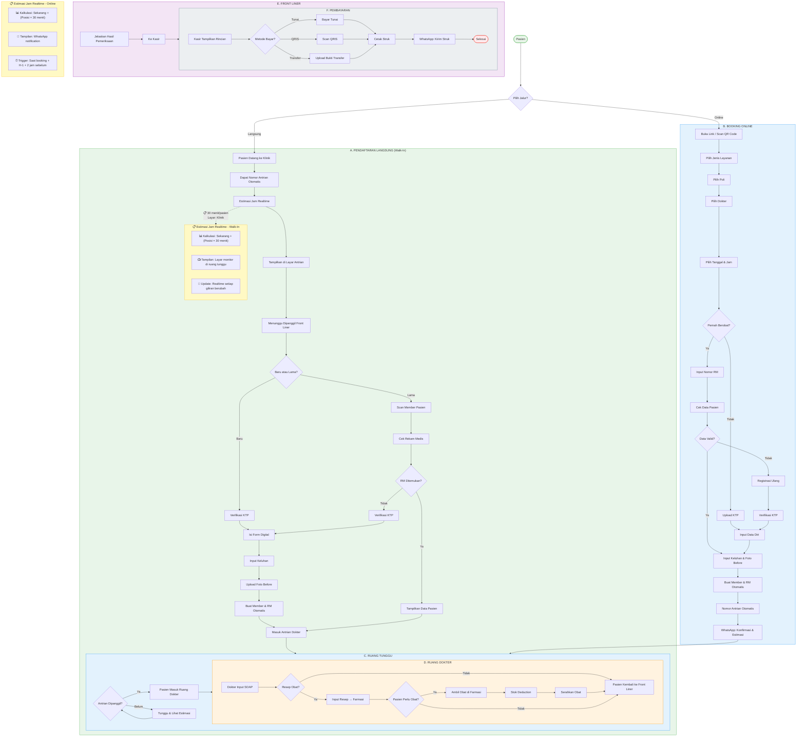

# Front Office Flowchart - Klinik Umum



---

## Legend

### Flow Symbols (Mermaid)

| Symbol | Syntax | Meaning |
|--------|--------|---------|
| `([Shape])` | `([Node])` | Rounded rectangle = Start/End point |
| `[Shape]` | `[Node]` | Rectangle = Process/Action |
| `{Shape}` | `{Node}` | Diamond = Decision point |
| `-->\|Label\|` | `-->\|Yes\|` | Arrow with condition label |
| `-.->` | `-.->"annotation"` | Dotted arrow = Annotation/Note |
| `subgraph` | `subgraph NAME["Title"]` | Group of related nodes |

### Color Coding

| Color | Hex | Module |
|-------|-----|--------|
| 🟢 Hijau | `#E8F5E9` | A. Pendaftaran Langsung (Walk-In) |
| 🔵 Biru | `#E3F2FD` | B. Booking Online |
| 🔵 Biru | `#E3F2FD` | C. Ruang Tunggu |
| 🟠 Orange | `#FFF3E0` | D. Ruang Dokter |
| 🟣 Ungu | `#F3E5F5` | E. Front Liner |
| ⬜ Abu | `#ECEFF1` | F. Pembayaran |
| 🟡 Kuning | `#FFF9C4` | Annotations (Estimasi, WhatsApp) |

### Main Paths

| Path | Description |
|------|-------------|
| **A. Pendaftaran Langsung** | Walk-in: Pasien datang → Langsung dapat nomor antrian |
| **B. Booking Online** | Online: Booking via link/QR yang disediakan klinik |
| **C. Ruang Tunggu** | Pasien menunggu dipanggil dokter |
| **D. Ruang Dokter** | Pemeriksaan (SOAP) & Resep |
| **E. Front Liner** | Penjelasan hasil pemeriksaan ke pasien |
| **F. Pembayaran** | Kasir: Tunai, QRIS, atau Transfer |

### Decision Points

| Decision | Options |
|----------|---------|
| `Pilih Jalur?` | Langsung / Online |
| `Baru atau Lama?` | Baru / Lama |
| `Rekam Medis Ditemukan?` | Ya / Tidak |
| `Pernah Berobat?` | Ya / Tidak |
| `Data Valid?` | Ya / Tidak |
| `Antrian Dipanggil?` | Ya / Belum |
| `Resep Obat?` | Ya / Tidak |
| `Pasien Perlu Obat?` | Ya / Tidak |
| `Metode Bayar?` | Tunai / QRIS / Transfer |

### Annotations

| Annotation | Meaning |
|------------|---------|
| `📋 30 menit/pasien` | Estimasi waktu per pasien |
| `📺 Layar: Klinik` | Display di monitor ruang tunggu |
| `📱 WA: Kirim Estimasi` | Kirim via WhatsApp |
| `📊 Kalkulasi` | Cara hitung estimasi |
| `⏰ Trigger` | Kapan notifikasi dikirim |

---

## Estimasi Jam Realtime

### Apa Itu Estimasi Jam?
Perkiraan waktu kapan giliran pasien akan dipanggil, berdasarkan posisi antrian dan estimasi waktu per pasien.

### Cara Kalkulasi
```
Estimasi = Waktu Sekarang + (Posisi dalam Antrian × 30 menit/pasien)
```

**Contoh:**
```
Jam Sekarang: 09:00
Nomor Sedang Diproses: #5
Posisi Pasien #8: #8 - #5 = 3 orang
Estimasi: 09:00 + (3 × 30 menit) = 09:30 - 10:00
```

### Dua Metode Estimasi

| Metode | Pendaftaran Langsung (Walk-In) | Booking Online |
|--------|--------------------------------|----------------|
| **Tampilan** | 📺 Layar monitor di ruang tunggu klinik | 📱 WhatsApp notification |
| **Update** | Realtime setiap nomor dipanggil | Saat booking + H-1 + 2 jam sebelum |
| **Trigger** | Otomatis saat antrian bergerak | Sistem reminder otomatis |

### Spesifikasi Teknis
- **Waktu per pasien:** 30 menit (bisa dikonfigurasi per poli)
- **Update trigger:** Setiap pasien dipanggil atau selesai
- **Display:** Compatible dengan TV monitor biasa (HDMI)

---

## Key Differences: Langsung vs Online

| Aspek | Pendaftaran Langsung | Booking Online |
|-------|----------------------|----------------|
| **QR Code** | ❌ Tidak ada | ✅ Link booking dijadikan QR |
| **Nomor Antrian** | Langsung saat datang | Setelah booking confirmed |
| **Baru/Lama Check** | Saat dipanggil front liner | Saat booking |
| **Estimasi Jam** | Realtime berdasarkan antrian | Dikirim via WhatsApp |

---

## WhatsApp Notification Triggers
- **📅 Booking Online:** Konfirmasi & Estimasi
- **⏰ H-1:** Reminder
- **🔔 2 Jam Sebelum:** Pengingat
- **📋 Giliran Mendekat:** Notifikasi
- **🧾 Setelah Bayar:** Struk

---

## Status Tracking

| Status | Description |
|--------|-------------|
| `walk_in` | Pasien datang, dapat nomor antrian |
| `waiting` | Di ruang tunggu |
| `called` | Dipanggil front liner |
| `registered` | Baru saja registrasi |
| `at_doctor` | Sedang diperiksa dokter |
| `pharmacy` | Ambil obat di farmasi |
| `billing` | Di kasir |
| `completed` | Selesai |

---

## Document Info

| Attribute | Value |
|-----------|-------|
| Module | Front Office |
| Clinic Type | Klinik Umum |
| Version | 1.1 |
| Last Updated | 2026-04-02 |
