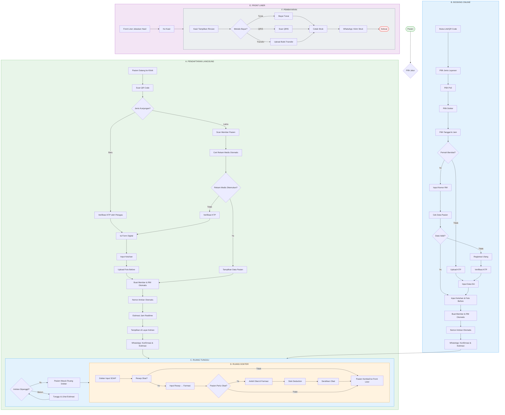

# Front Office Flowchart - Klinik Umum

---

## Legend

| Symbol | Meaning |
|--------|---------|
| `-->|Label|` | Decision with condition |
| `---` | Default flow |
| Color Blocks | Different modules/sections |
| 📱 WhatsApp | Notification triggers |

### WhatsApp Notification Triggers
- **📅 Booking:** Konfirmasi & Estimasi
- **⏰ H-1:** Reminder
- **🔔 2 Jam Sebelum:** Pengingat
- **📋 Giliran Mendekat:** Notifikasi
- **🧾 Setelah Bayar:** Struk

---

## Key Flow Points

### A. Pendaftaran Langsung
1. Pasien datang → Scan QR
2. **Baru:** Verifikasi KTP → Form Digital → Keluhan → Foto → Auto Member
3. **Lama:** Scan Member → Auto-check EMR
4. Generate Queue # → Estimasi Jam → Display

### B. Booking Online
1. Buka Link → Pilih Layanan → Poli → Dokter → Jadwal
2. Check: Pernah berobat?
3. **Baru:** Upload KTP → Registrasi
4. **Lama:** Input RM → Validasi
5. Generate Queue # → WhatsApp Konfirmasi

### C-F. Waiting Room → Doctor → Front Liner → Kasir
- Patient waits with realtime estimate
- Called by doctor → Enter room
- SOAP input → Resep if needed
- Return to Front Liner for explanation
- Go to Kasir for payment
- Send receipt via WhatsApp

---

## Status Tracking

| Status | Description |
|--------|-------------|
| `registered` | Baru daftar, dapat queue number |
| `waiting` | Di ruang tunggu |
| `called` | Dipanggil dokter |
| `in_progress` | Sedang diperiksa |
| `pharmacy` | Ambil obat di farmasi |
| `billing` | Di kasir |
| `completed` | Selesai |

---

## Document Info

| Attribute | Value |
|-----------|-------|
| Module | Front Office |
| Clinic Type | Klinik Umum |
| Version | 1.0 |
| Last Updated | 2026-04-02 |
