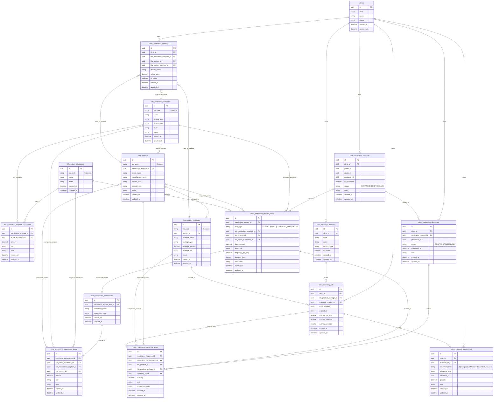

Ya. Kalau dibikin ulang supaya **selaras**, ERD domain obatnya sebaiknya dipisah jadi **2 boundary besar**:

1. **Landlord / global master KFA**
2. **Tenant / operasional klinik**

Di bawah ini versi full yang saya sarankan untuk domain ini saja.

## Inti desainnya

* **BZA / 91** → `kfa_active_substances`
* **POV / 92** → `kfa_medication_templates`
* **POA / 93** → `kfa_products`
* **POAK / 94** → `kfa_product_packages`

Lalu di tenant:

* **dokter menulis resep** di `clinic_medication_requests` + `clinic_medication_request_items`
* **farmasi menebus** di `clinic_medication_dispenses` + `clinic_medication_dispense_items`
* **stok nyata** ada di `clinic_inventory_lots`
* **mutasi stok** ada di `clinic_inventory_movements`

## Kenapa ada `clinic_medication_catalogs`

Supaya tiap klinik bisa punya:

* nama tampil lokal
* harga jual
* status aktif/nonaktif
* mapping ke KFA master

Jadi KFA tetap global, tapi operasional tetap fleksibel.

## Bagian yang paling penting

Di level resep:

* non-racikan: dokter pilih **POV atau POA**
* racikan: dokter pilih **BZA** atau kombinasi komponen

Di level dispensing:

* yang benar-benar keluar dari farmasi sebaiknya tercatat sebagai **POA**
* pengurang stok mengambil dari **POAK / lot stok**

Itu yang bikin alurnya nyambung dari klinik sampai inventory.

Kalau mau, langkah berikutnya yang paling berguna adalah saya turunkan ERD ini jadi **versi Mermaid yang lebih ringkas** atau langsung jadi **struktur migration / GORM model**.
